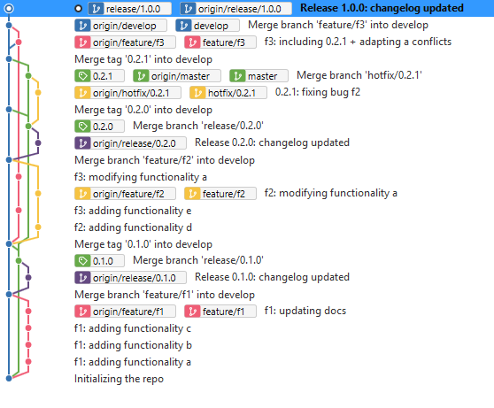

# Code&Bricks E-commerce using git flow

All involved branches are pushed and left untouched so the exercise looks as clear as possible.

- [Code&Bricks E-commerce using git flow](#codebricks-e-commerce-using-git-flow)
  - [Timeline:](#timeline)
  - [Git History](#git-history)
  - [Changelog](#changelog)
    - [Release 0.1.0](#release-010)
    - [Release 0.2.0](#release-020)
    - [Release 0.2.1](#release-021)
    - [Release 1.0.0](#release-100)

## Timeline:
- f1 feature should be developed and delivered as soon as possible (release 0.1.0)
- f2 and f3 are developed in parallel
- f2 gets finished and released (release 0.2.0)
- a bug is found in prod, hotfix delivered (release 0.2.1)
- f3 gets finished and released, taking care of conflicts and including hotfix (1.0.0)

## Git History

## Changelog
### Release 0.1.0
- New Feature 1
### Release 0.2.0
- New Feature 2
### Release 0.2.1
- Fix for Feature 2 bug
### Release 1.0.0
- New feature 3